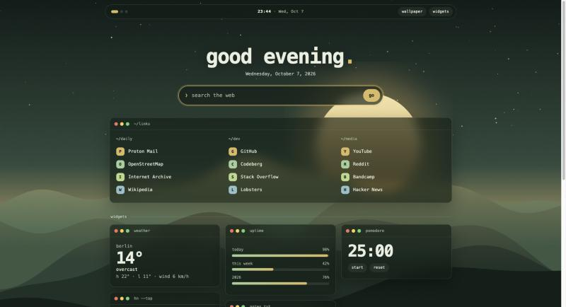
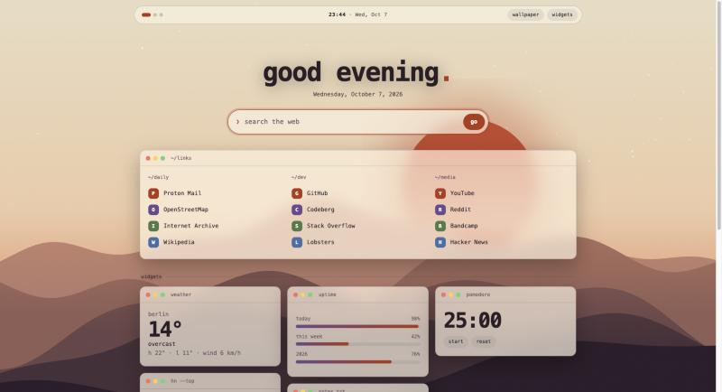

# comfy-dashboard

A cozy, single-file browser start page. One `index.html`, no build step, no dependencies, no tracking. Set it as your homepage and make it yours.

| `moss` | `ink` |
|---|---|
|  |  |

## Features
- **Favorite links**, grouped, as a numbered list with letter badges (no external favicons).
- **Search bar** that sends queries to Startpage by default (configurable).
- **Optional widgets** you can toggle on and off in the page: weather (Open-Meteo), Hacker News top stories, time progress (day / week / year), notes, to-do list, focus timer.
- **Three generated wallpapers** (`dusk`, `moss`, `ink`) drawn in code as SVG, so there are no image files to license. Switch with the *wallpaper* button.
- **Private:** notes, to-dos, widget choices and wallpaper are stored only in your browser (`localStorage`).
- Works offline apart from the weather and news widgets.

## Use it
1. Download or clone this repo.
2. Open `index.html` in your browser to try it.
3. Set it as your homepage, using the file URL, e.g. `file:///path/to/comfy-dashboard/index.html`.
   - Firefox: Settings → Home → Custom URLs.
   - Chrome / Edge: Settings → On startup → Open a specific page (and Appearance → Show home button).

## Customize
Edit the `CONFIG` block at the top of the `<script>` in `index.html`:

| Option | What it does |
|---|---|
| `name` | Name shown in the greeting |
| `searchUrl` | Search engine endpoint that takes `?q=` |
| `weather` | City label plus latitude/longitude ([find coordinates](https://open-meteo.com)) |
| `wallpapers` | Which palettes the wallpaper button cycles through |
| `links` | Groups of `[label, url]` pairs |
| `defaultWidgets` | Widgets enabled on first load |

**Add a palette:** copy a `:root[data-wp=…]` block in the CSS, change the colors, and add its name to `wallpapers`.

**Add a widget:** add an entry to `WIDGETS` with a `title`, a window-title `file`, and a `render(body)` function. It then appears in the widgets panel automatically. Return a timer id from `render` if it needs cleaning up.

## Privacy
The weather widget calls `api.open-meteo.com` and the news widget calls `hacker-news.firebaseio.com`. Turn those widgets off and the page makes no network requests at all.

## License
MIT, see [LICENSE](LICENSE). The wallpapers and screenshots are generated by this project's own code.
