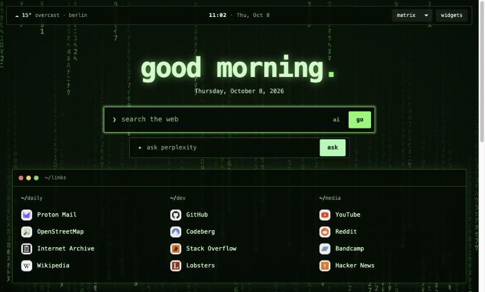
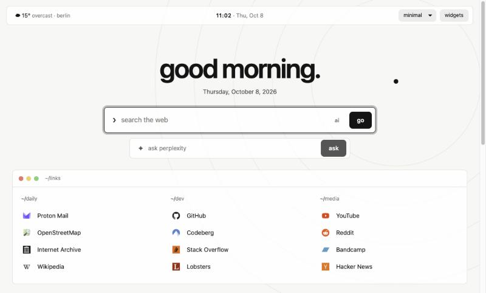
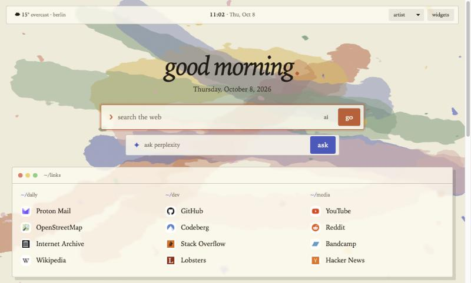
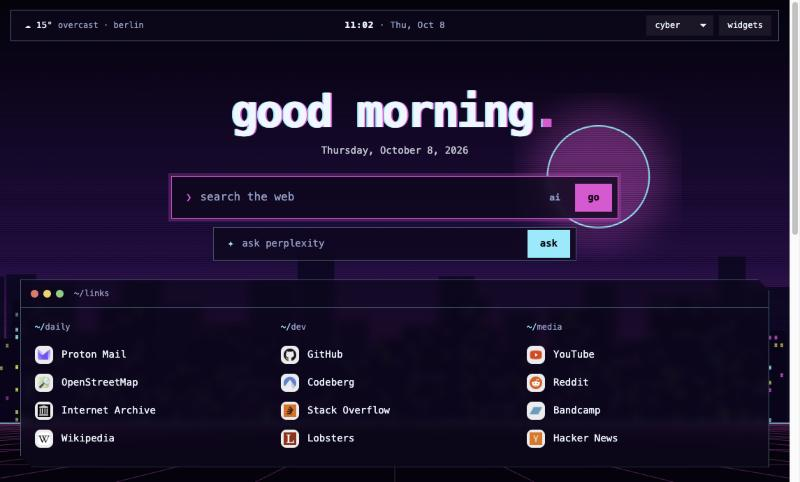
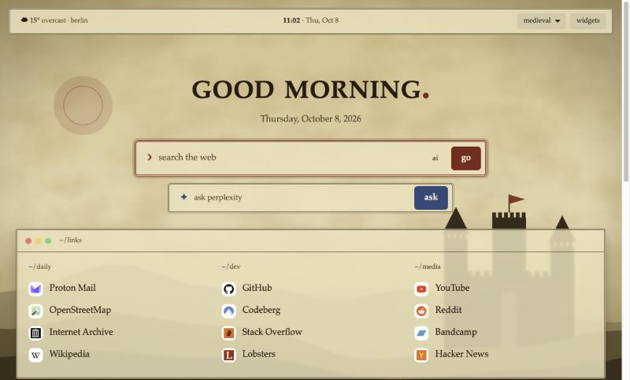
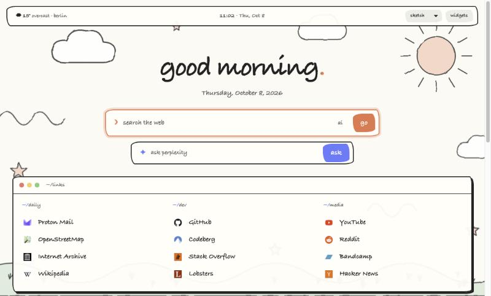

# comfy-dashboard

A cozy, single-file browser start page. One `index.html`, no build step, no dependencies, no tracking. Set it as your homepage and make it yours.

| `moss` | `ink` |
|---|---|
|  |  |
| **`matrix`** | **`minimal`** |
|  |  |
| **`artist`** | **`cyber`** |
|  |  |
| **`medieval`** | **`sketch`** (hand drawn) |
|  |  |

## Features
- **Favorite links**, grouped, with each site's own favicon (letter badge as a fallback; switch off with `favicons: false`).
- **Two search bars:** Startpage (default, configurable) and a second one that asks Perplexity directly.
- **"ai" toggle** inside the Startpage search bar (crossed out = on): adds `before:2022-01-01` to your query so results predate the AI boom (the choice is remembered; change the date with `noAiBefore`).
- **Weather in the top bar** (Open-Meteo), next to the clock.
- **Optional widgets** you can toggle on and off in the page: Hacker News (front page, or top of the past hour / day / week / month), time progress (day / week / year), notes, to-do list, focus timer.
- **Nine themes** with their own artwork, colors, fonts and shapes: `dusk`, `moss`, `ink`, `matrix` (falling code), `minimal`, `artist`, `cyber`, `medieval` and `sketch` (hand drawn). Everything is drawn in code, so there are no image files to license. Pick one from the theme dropdown in the top bar (hover an entry to preview it, click to apply); your choice is remembered.
- **Private:** notes, to-dos, widget choices and wallpaper are stored only in your browser (`localStorage`).
- Works offline apart from the weather and the news widget.

## Use it
1. Download or clone this repo.
2. Open `setup.js` and fill in your name, links, weather city and so on.
3. Open `index.html` in your browser to try it.
4. Set it as your homepage, using the file URL, e.g. `file:///path/to/comfy-dashboard/index.html`.
   - Firefox: Settings → Home → Custom URLs.
   - Chrome / Edge: Settings → On startup → Open a specific page (and Appearance → Show home button).

## Customize
All your data lives in **`setup.js`**, a plain list of variables. Edit it, save, reload the page. To share your setup, send that one file; to import someone else's, drop it in place of yours.

| Option | What it does |
|---|---|
| `name` | Name shown in the greeting |
| `searchUrl` | Search engine endpoint that takes `?q=` |
| `askUrl` | Endpoint for the second search bar (Perplexity by default) |
| `noAiBefore` | Cut-off date used by the crossed-out "ai" toggle |
| `favicons` | `true` (default) shows each site's own favicon, fetched from that site; `false` uses letter badges only. A link can take a third entry with a custom icon URL |
| `hnRange` | Default range of the Hacker News widget: `front`, `hour`, `day`, `week` or `month` |
| `weather` | City label (shown in the top bar) plus latitude/longitude ([find coordinates](https://open-meteo.com)) |
| `themes` | Which themes the theme button cycles through (first = default) |
| `greetings` | Greeting text for night / morning / afternoon / evening, in any language |
| `links` | Groups of `[label, url]` pairs |
| `defaultWidgets` | Widgets enabled on first load |

If `setup.js` is missing or leaves something out, sensible defaults are used.

**Add a theme:** copy a `:root[data-wp=…]` block in the CSS of `index.html` (colors, fonts, corner shapes), optionally add a `PAINT.yourname` function that draws its background as SVG, and add the name to `themes` in `setup.js`.

**Add a widget:** add an entry to `WIDGETS` in `index.html` with a `title`, a window-title `file`, and a `render(body)` function. It then appears in the widgets panel automatically. Return a timer id from `render` if it needs cleaning up.

## Privacy
The weather in the top bar calls `api.open-meteo.com`; the news widget calls `hacker-news.firebaseio.com` (front page) or `hn.algolia.com` (other time ranges). With `favicons` on, the page also requests each linked site's own `favicon.ico` (no third-party icon service). The weather request can't be switched off, so the page is not fully offline. Turn off the news widget and set `favicons: false` to limit it to that one call.

## License
MIT, see [LICENSE](LICENSE). The themes are drawn by the page's own code, so there are no third-party assets.
